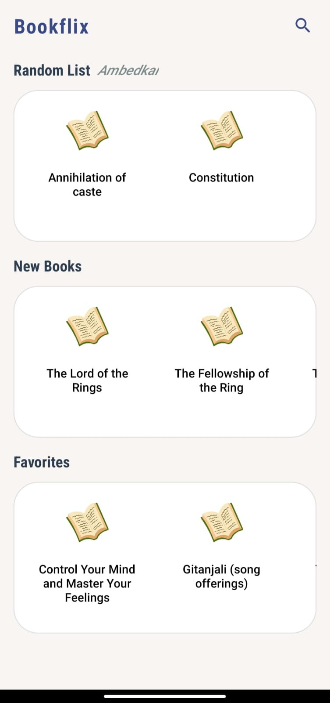
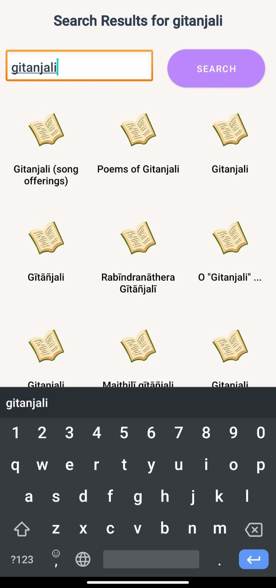
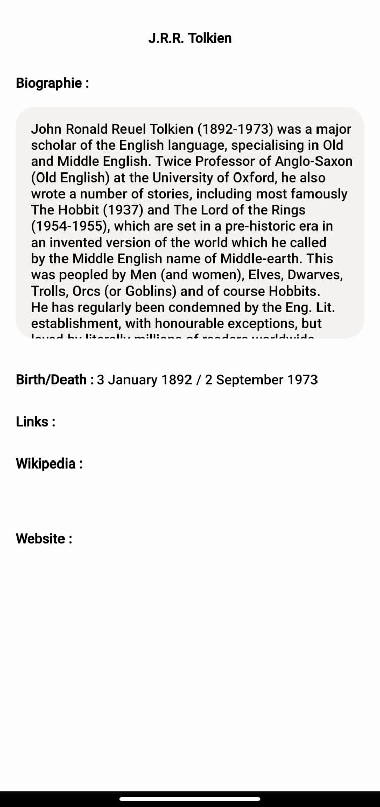
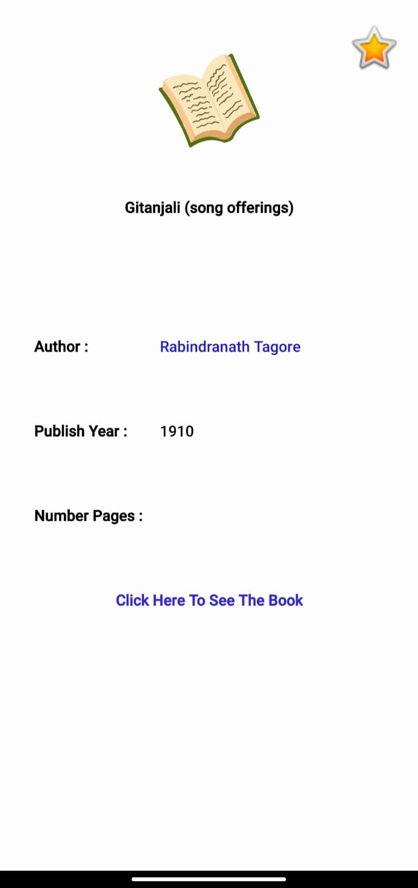
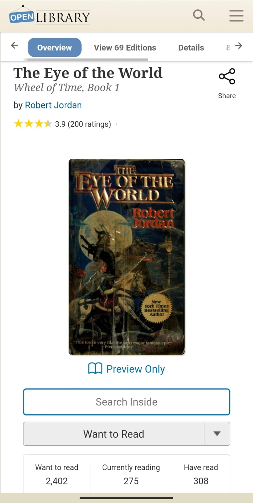

# BookFlix 📚 – The Ultimate Digital Library

**BookFlix** is an Android-based mobile application that brings a curated digital library to your fingertips. The app allows users to search for books, explore detailed author biographies, view online reading links, and manage personal favorites — all within an intuitive, minimalist UI.

---

## 📸 Screenshots

| Home Screen – Book Categories | Book Search | Author Profile |
|------------------------------|-------------|----------------|
|  |  |  |

| Book Details | Read Online |
|--------------|-------------|
|  |  |

---

## ✨ Features

- 🔍 **Search Books**  
  Search for any book by title and instantly view results in a clean grid format.

- 📖 **Read Online**  
  Clickable links to view or read books directly online.

- 👤 **Author Profiles**  
  Explore author bios, birth/death dates, and available external links like Wikipedia and official websites.

- 📚 **New, Random & Favorite Books**  
  Curated sections for:
  - New arrivals
  - Random recommendations
  - User favorites (add/remove easily)

- ⭐ **Add to Favorites**  
  Users can mark any book as a favorite to access it quickly from their personal list.

---

## 🛠 Tech Stack

- **Android Studio**
- **Java**
- **SQLite**
- **REST API** (for dynamic book/author info)
- **RecyclerView + CardView** for display

---

## 🚀 How to Run the App

1. Clone this repository:
   ```bash
   git clone https://github.com/prasadlonare35/Bookflix-Android-App.git
2. Open it in Android Studio.

3. Sync Gradle & build the project.

4. Run on emulator or physical device (Android 6.0+ recommended).

---

## 📌 Future Improvements
- Add dark mode support 🌙
- Add user authentication for personalized libraries 🔐
- Download & offline reading option 📥
- Admin panel to upload books or manage content 🧑‍💼

---

## 🎯 Purpose
This project is part of my Mobile App Development learning journey. BookFlix combines creativity, UI design, and core Android components to create a helpful and user-friendly digital book experience.

---
